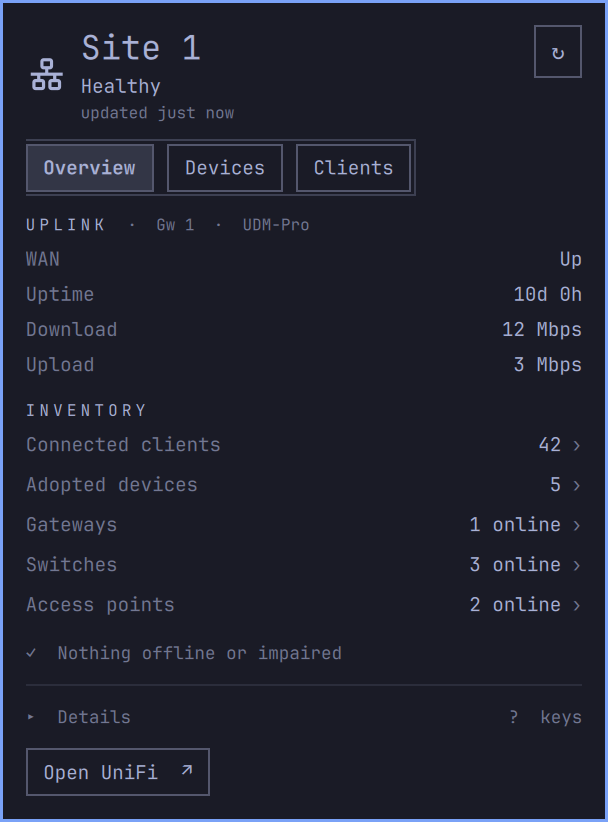
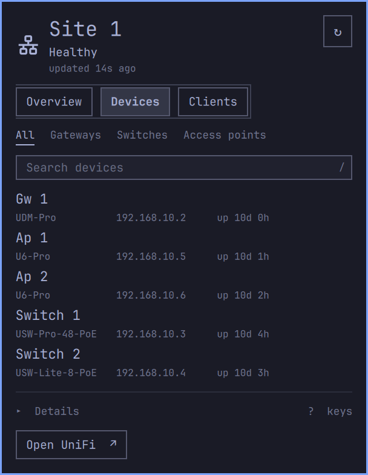
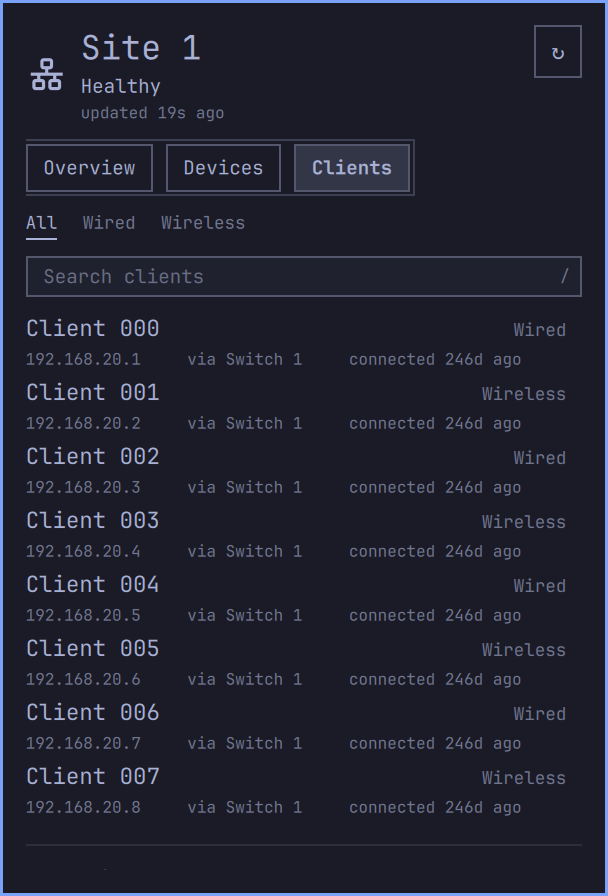
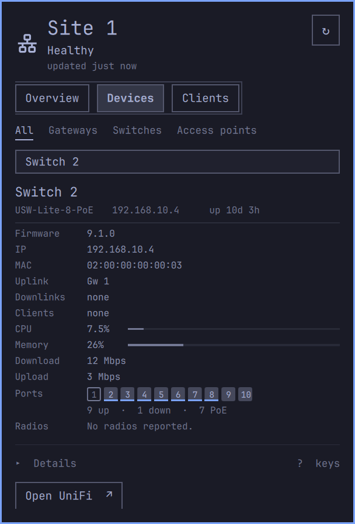
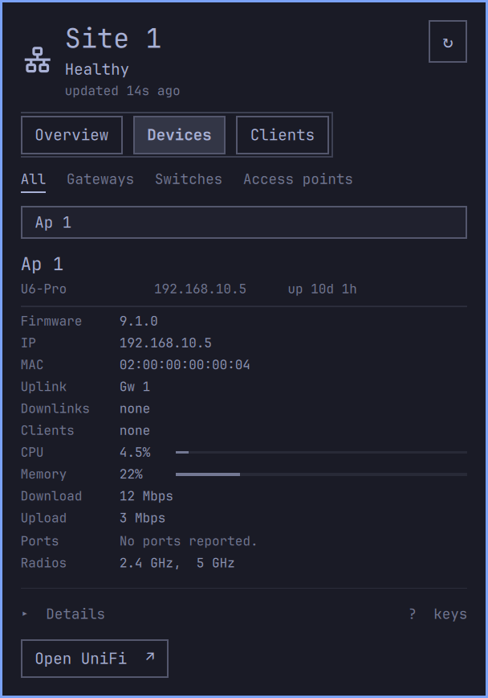

# omarchy-unifi

Check your UniFi network from the Omarchy bar. Click the icon to find offline
or impaired devices, see connected clients, and browse device details. The
plugin only reads from your controller; it never changes its configuration.

Tested with a UDM Pro running UniFi Network 10.6.101, with manual checks across
three Omarchy themes including one light theme.

## Screenshots

<p align="center">
  
  
  
</p>

Expand a device to see its firmware, addresses, uplink, CPU and memory,
throughput, and its ports or radios. A switch shows every port as a square:
filled when up, outlined when down, and underlined when it carries PoE.

<p align="center">
  
  
</p>

## Before you install

You'll need:

- Omarchy **4.0.3-1** with Quickshell **0.3.1-1**.
- Python **3.9 or newer**. No pip packages are needed.
- UniFi Network **10.6.x** for hardware-tested support, with the Network
  Integration API available.
- A dedicated API key from your UniFi console: **Settings → Control Plane →
  Integrations** (older firmware: **Settings → System → Advanced**). Copy the
  key when you create it; the console won't show it again.

The helper also accepts **9.1.x**, but that line has not been validated on
hardware. Other versions are rejected. If yours is unsupported,
[open an issue](https://github.com/gaius-codius/omarchy-unifi/issues) with its
`applicationVersion`.

**WAN monitoring has a limitation:** the tested UDM Pro doesn't identify itself
as a gateway through the API. On that controller, WAN status is unknown, gateway
uptime and throughput are unavailable, and the bar cannot show “all gateways
down”. Device and client monitoring still work.

## Install

```bash
omarchy plugin add https://github.com/gaius-codius/omarchy-unifi
omarchy plugin enable gaius-codius.unifi
```

The icon appears on the bar after [setup](#set-up-your-controller), which places
the widget. Enabling the plugin alone does not start it.

## Set up your controller

Run the wizard from the installed plugin:

```bash
~/.config/omarchy/plugins/gaius-codius.unifi/scripts/setup
```

It asks for your controller address (default `unifi.local`) and API key, checks
the connection, selects a site, saves the configuration and adds the widget to
the bar. Key input is hidden. With multiple sites, it asks which one to use.

For a self-signed certificate, the wizard retrieves it for you and displays its
SHA-256 fingerprint. Compare it through an independent trusted connection to
your controller, then paste the verified fingerprint to approve it. The wizard
saves the certificate and keeps TLS verification enabled.

Use a hostname that resolves on your machine and matches the certificate.
Setup checks this first and tells you how to fix it if it doesn't — on
Omarchy a `.local` name needs an `/etc/nsswitch.conf` change as well as an
`/etc/hosts` entry; see [name resolution](docs/controller-setup.md).
The wizard won't change your DNS settings or accept a mismatched or expired
certificate. See [certificate troubleshooting](docs/controller-setup.md) if it
cannot verify the connection.

After setup, click the bar icon and check the site name and last-update time.
The wizard verifies API access; the panel confirms that the widget is refreshing.

Using an AI agent? Follow the [agent instructions](docs/agent-instructions.md).
For manual configuration, see the [configuration reference](docs/usage.md#controller-configuration).

## Use the widget

The bar icon follows your Omarchy theme. Its tooltip states the network
condition in words. Click it to open the panel:

- Check site health, offline devices and available WAN information in **Overview**.
- Search and filter **Devices**, then expand a row for firmware, resource usage,
  connections, ports and radios.
- Browse **Clients** to see addresses, connection types and connection times.

Click an address, MAC address or site ID to copy it. **Open UniFi** opens the
controller dashboard. Missing metrics read “unknown”. If a list is incomplete,
the panel shows that limit rather than presenting a partial count as a total.

See the [usage and settings reference](docs/usage.md) for status indicators,
keyboard shortcuts, refresh interval, dashboard URL and other options.

To show the connected client count beside the icon:

```bash
omarchy bar set gaius-codius.unifi compactMetric clients
```

## Update

```bash
omarchy plugin update gaius-codius.unifi
omarchy restart shell
```

A shell restart is required so the new code loads. Configuration and bar-layout
changes apply live without a restart.

## Troubleshooting

| Problem | What to do |
|---|---|
| No widget or updates | Add the widget to the bar; enabling the plugin alone doesn't start its service. |
| Unsupported controller version | Use a supported version; only 10.6.x has been tested on hardware. |
| TLS error | Check the hostname and certificate using the [setup guide](docs/controller-setup.md). |
| Controller can't be reached, or its name won't resolve | Check `getent hosts <name>`. If it prints nothing, see [name resolution](docs/controller-setup.md). Omarchy ships the mDNS entry *ahead of* `files` on the `hosts:` line of `/etc/nsswitch.conf`, which stops `/etc/hosts` from being read for a `.local` name; move `files` ahead of it. |
| WAN status is unknown | See the gateway limitation above. |
| Edited config files by hand | Run `~/.config/omarchy/plugins/gaius-codius.unifi/scripts/configure --commit`. |
| Duplicate widgets disagree | If the widget was added twice in `shell.json`, give both entries the same `refreshIntervalSec`, or remove the extra copy. |

## Remove

```bash
omarchy plugin disable gaius-codius.unifi
omarchy plugin remove gaius-codius.unifi
```

Your saved configuration and API key remain in `~/.config/omarchy-unifi/`.
To delete them too:

```bash
rm -rf ~/.config/omarchy-unifi
```

Revoke the API key in the UniFi console as well. Deleting the local copy doesn't
invalidate it.

## Security

Use a dedicated Integration API key for the plugin. The plugin only makes read
requests. Report vulnerabilities privately through the [security policy](SECURITY.md).

## Development

See [development and testing](docs/development.md) for the test commands,
local QML checks and project documentation.

## Licence

MIT. See [LICENSE](LICENSE).
